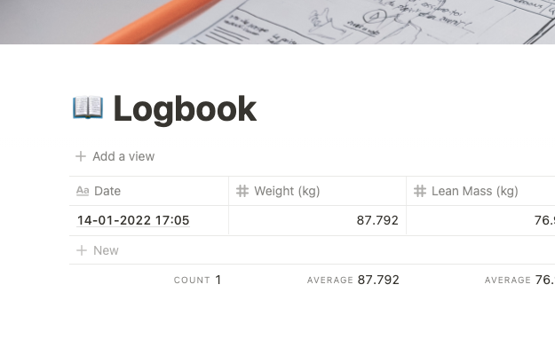

# `weight-logger`

`weight-logger` is a simple application which enables you to sync readings from your Withings scale to a Notion page.

## Preview



## Installation

### Requirements

-   [Withings Account](https://healthmate.withings.com/)
-   [Notion Account](https://notion.so)
-   [IFTTT Account](https://ifttt.com/home)
-   Server running [`docker`](https://www.docker.com/) _and_ [`docker-compose`](https://docs.docker.com/compose/)

### Getting Started

1. Clone this repository on your server and enter it

```bash
git clone git@github.com:4dams/weight-logger.git && \
cd weight-logger
```

2. Create a new [Notion Integration](https://www.notion.so/my-integrations) ([notion.so/my-integrations](https://www.notion.so/my-integrations)) and copy its **Internal Integration Token**:


_I've changed mine, don't worry_ 😉

3. Create a `docker-compose.yml` file, for example:

```yaml
# docker-compose.yml

version: "3.7"

services:
    logger:
        build:
            context: .
        container_name: logger
        ports:
            - 3000:3000
        environment:
            # This is the "Internal Integration Token" from before
            - NOTION_API_KEY=secret_Gix...
```

4. Start the application

```bash
docker-compose up -d
```

5. Create a new [IFTTT Applet](https://ifttt.com/create) ([ifttt.com/create](https://ifttt.com/create))

-   Choose _Withings_ > _When I have a new weight_ as your trigger.
-   Choose _Webhooks_ > _Make a web request_ as your service
-   Configure the service as follows:


As for the Body, **copy and paste** the following:

```
{
	"date": "{{DateAndTime}}",
	"unit": "{{Unit}}",
	"weight": {{Weight}},
	"fatMass": {{FatMass}},
	"fatMassPercent": {{FatMassPercent}},
	"leanMass": {{LeanMass}}
}
```

6. Click Save and step on your scale! 🎉

## Help and Issues

Feel free to open an issue or shoot me an email over at [`hello@adams.sh`](mailto:hello@adams.sh), should you have any questions or need help setting up the app!

## License

Do whatever you want, just leave credit. :)
